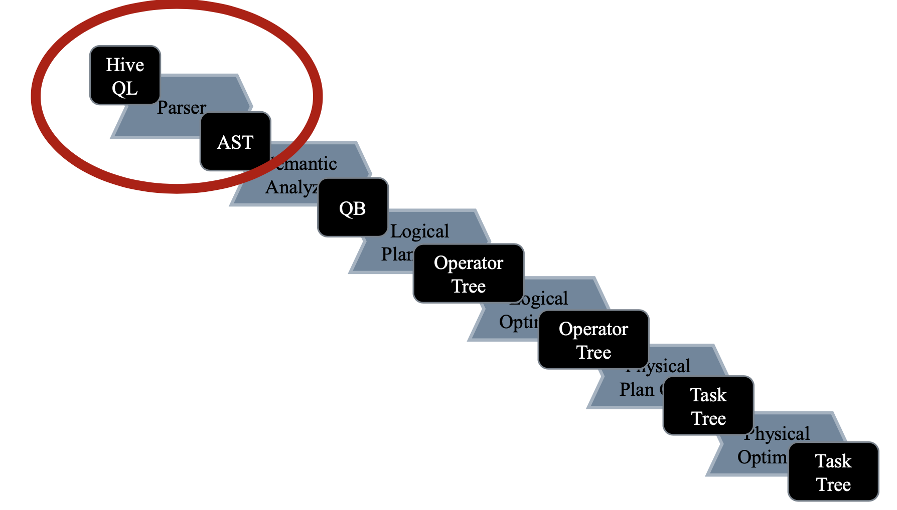
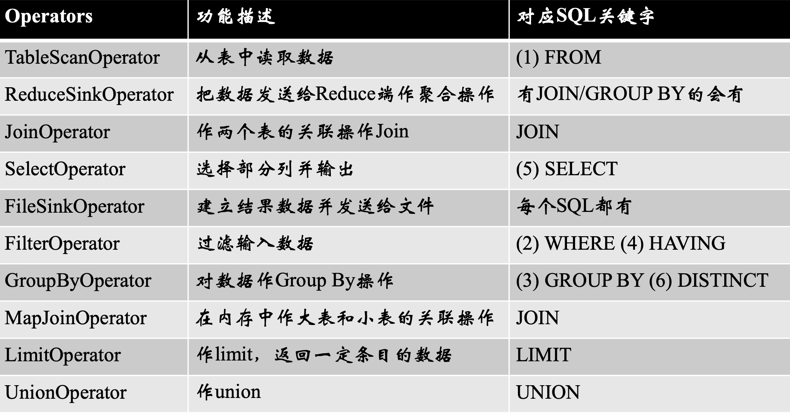

```shell
# 查找入口（main函数）
find . -name '*.java' | xargs grep --color 'main(' | awk '{print $1}' | uniq | grep -v test
```

客户端主入口：CliDriver

源码分析入口：Driver.compile()

Hive执行流程图：



#### SQL执行顺序

一个SQL大致分为以下7部分，按顺序执行 

- (5)SELECT
- (6)DISTINCT <select list>
- (1)FROM <table source>
- (2)WHERE <condition> 
- (3)GROUP BY <group by list> 
- (4)HAVING <having condition> 
- (7)ORDER BY <order by list>

#### Operators对应SQL

- 每个步骤对应一个逻辑运算符(Operator) 
- 每个Operator输出一个虚表(VirtualTable)
- Explain 可查看执行计划
- 对抗 Join 倾斜最有力的工具就是MapJoin。




