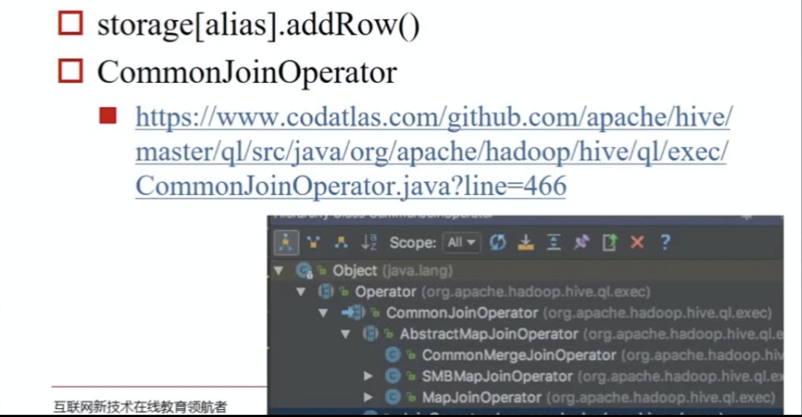

#### Operator接口

[源码：Operator.java](https://github.com/apache/hive/blob/master/ql/src/java/org/apache/hadoop/hive/ql/exec/Operator.java#L574)

```java
/**
 * Base operator implementation.
 **/
public abstract class Operator<T extends OperatorDesc> implements Serializable,Cloneable,Node {
}
```


```java
/**
   * Process the row.
   *
   * @param row
   *          The object representing the row.
   * @param tag
   *          The tag of the row usually means which parent this row comes from.
   *          Rows with the same tag should have exactly the same rowInspector
   *          all the time.
   */
  public abstract void process(Object row, int tag) throws HiveException;
```

- 每个进程一个实例
- 每个实例开始执行一次initialize()方法
- 每个实例执行多次process()方法，每行执行 一次，这个进程有几行就执行几次
- 每个实例最后执行一次close()方法

#### GroupByOperator

[源码：SemanticAnalyzer.genBodyPlan()](https://github.com/apache/hive/blob/master/ql/src/java/org/apache/hadoop/hive/ql/parse/SemanticAnalyzer.java#L10869)

- hive.map.aggr : 使用Map端预聚合，默认打开
  - 两个GroupByOperator,Map端一个，Reduce端一个，类似MR Combiner
- hive.groupby.skewindata : 是否优化倾斜的查询为两道作业，默认关闭
  - set hive.groupby.skewindata=true
  - 切为两个MR任务

#### JoinOperator 

- Join是Hive是最难的部分，也是最需要优化的部分

- 常用Join方法
  - 普通(Reduce端)Join， Common (Reduce-Side) Join 
  - 广播(Map端)Join，Broadcast(Map-Side)Join
    - hive.auto.convert.join
    - hive.mapjoin.smalltable.filesize
    - 没有Reduce
  - Bucket Map Join
  - Sort Merge Bucket Map Join
  - 倾斜Join，Skew Join



MapJoin：只适合小表足够小的情况，占用内存资源。

SMB Join：Bucket Map Join + Sort

